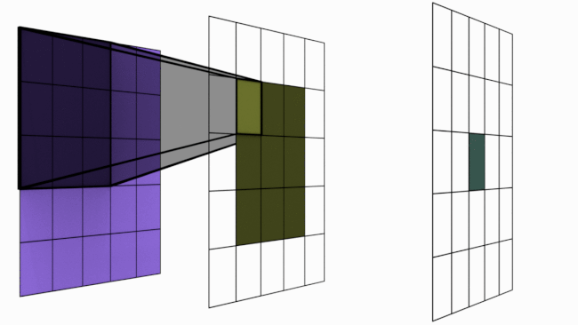

#### Fundamentals of AI
###### Channels
Any color can be made through a combination of different kinds of "primary color" combinations. 
    - RGB is not the only model.
    - CMYK, 
    - CMY, 
    - YIQ, 
    - LAB, 
    - HSV, 
    - XYZ, etc!

Images:: Edges & Gradients, Textures, and Patterns, Part of Objects and Objects

Audio::  Air vibration, Phoneme, Sound of a word, Sound of a full sentence

Word::   Characters, Words, Sentences, Paragraphs, Book

Waves::  Sine and cosine (fourier)

- A collection of neurons that holds contextually similar information
- Output of FC layer
- Output of kernels

`Anything complex can be made from simpler stuff!`

<!--  -->

<!--  -->

###### Core Concepts
- Convolution

<!--  -->

Kernel: Feature Extrator

3x3 The 9 values we have in a 3x3 kernel are the values which our neural network needs to learn! 

*we are adding imaginary numbers. This by the way is called padding

- Fully Connected Layers

  suffers (lost in position information after transforming) so, there is no concept of spatial or temporal information. Neurons are responsible to learn an abstract representation of the data
  
**flatterned three**

**three**

conversion of spatial to temporal data and vice-versa

###### RF and Attentions

**It's the area that you can pay attention to and understand at any given moment**

Image::RF

RF of the kernels in the last layer atleast equal to size of an imahe

NLP::attention

