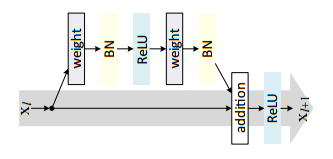
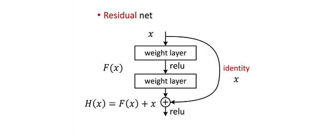
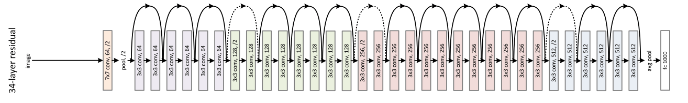
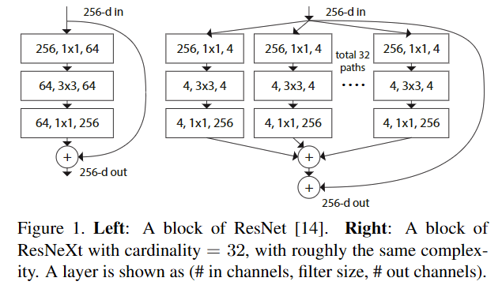
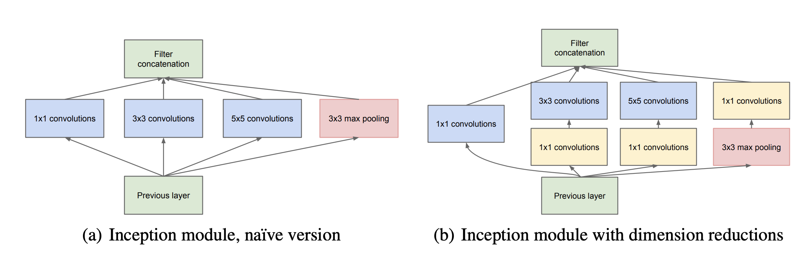
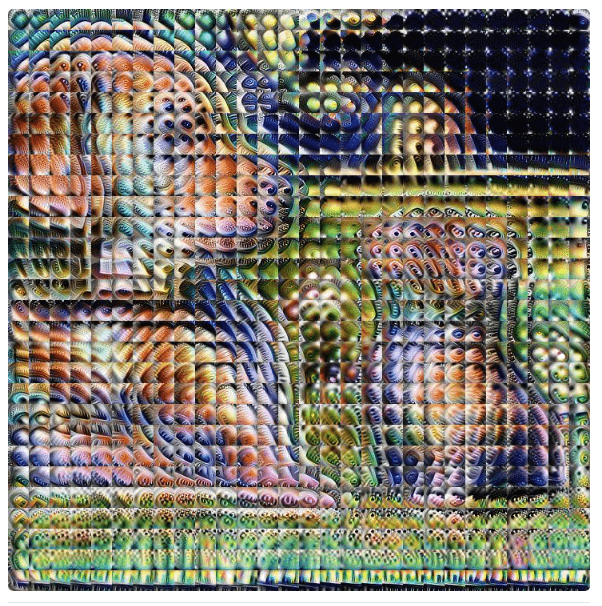
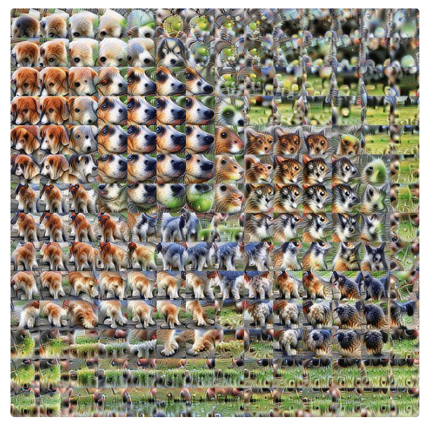
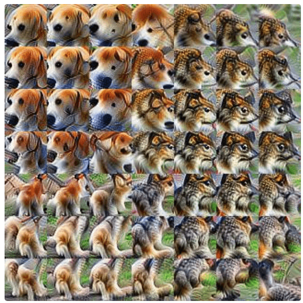
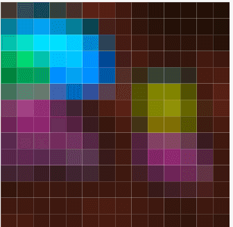
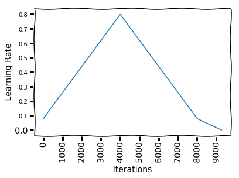

#  Residual Connections in CNNs and One Cycle Policy 🌀


## Receptive Field more than size of the Image

- [X] different sizes and Variations
- [X] occulations
- [X] positions 
<p align="center">
  
</p>


## ResNet Block (Eulers Integration)
Euler Integrator $$x_{k+1}=x_{k}+ƒ({x_{k})}$$ where, $x_{k}$ is Identity layer (or) skip connection


|    |  |   |
|:----------------------:|:----------------------:|:---------------|


<p align="center">
  
</p>
 
 `NOTE`: The stacking layers shouldn't degrade the network performance, because we could simply stack identity mappings

For ResNet, there are two kinds of residual connections:
- the identity shortcuts (x) can be directly added with the input and output are of the same dimensions
- when the dimensions change (input is larger than residual output, but we need to add them). The default way of solving this is to use a 1x1 Conv with a stride of 2. Yes, half of the pixels will be ignored. 


# ResNet Model Walkthrough

## ResNet34
<p align="center">
  
</p>

- 1 conv layer of kernel_size=7 (64) with stride=2 and rest all are kernel_size=3
- followed by MaxPool. (no other maxpool)
- followed by 4 **BASIC** Resnet blocks with config (3times, 4times, 6 and 3times) repetation
- channels are constant in each block (64, 128, 256, 512 respectively)
- channel size is constant in each block
- except for the first block each block starts with kernel_size=3 with stride=2 (no maxpool)
- dotted lines are kernel_size=1 with stride=2

```
R18    - Regular        - 2, 2, 2, 2
R34    - Regular        - 3, 4, 6, 3
```


## ResNet50

<p align="center">
  
</p>
deeper non-bottleneck ResNets also gain accuracy from increasing depth, but are not as economical as the bottleneck ResNets. So the usage of bottleneck designs is mainly due to practical considerations. 

### BottleNeck (piece of ART 🎨)


```
R18     - Regular        - 2, 2, 2, 2
R34     - Regular        - 3, 4, 6, 3
R50     - Bottleneck     - 3, 4, 6, 3
R101    - Bottleneck     - 3, 4, 23, 3
R152    - Bottleneck     - 3, 8, 36, 3
```


## ResNeXt
## Aggregated Transformations (piece of ART 🎨)



## Pre-activation ResNet
## Wide Residual Networks
## ResNet-D
## ResNet-L
## Residual Attention Network
## PyramidNet
## Res2Net


# INCEPTION ⠀**🇬**🔎🎬
## Inception Module (piece of ART 🎨)
Instead of Adding do concatenation



Change in "Current Views" As we do down the layers
--------------------------------------------------
|    |  | || ||
|:----------------------:|:----------------------:|:---------------|:----------------------:|:---------------|:----------------------:|

`NOTE`: When we do **Transfer Learning** keep distance from softmax

# One Cycle Policy 🌀


- [Disciplined Approach to NN Hyperparameters](https://arxiv.org/abs/1803.09820) 
- run LRFinder
- It is recommended to not pick the learning rate that achieves the lowest loss, but instead something in the middle of the sharpest downward slope.
- Min can be set as 10 times smaller than Max LR
- Annealing LR should be 10/100 times smaller than the minimum LR
- Don't forget to reset!
- provide us with higher accuracy in practice? **NO**


## Blogs
- [Feature Visualization](https://distill.pub/2017/feature-visualization/)
- [Residual Connection](https://cthorey.github.io/blog/2021/resnet/)
- [Cifar10 fast bag-of-tricks](https://github.com/davidcpage/cifar10-fastV)