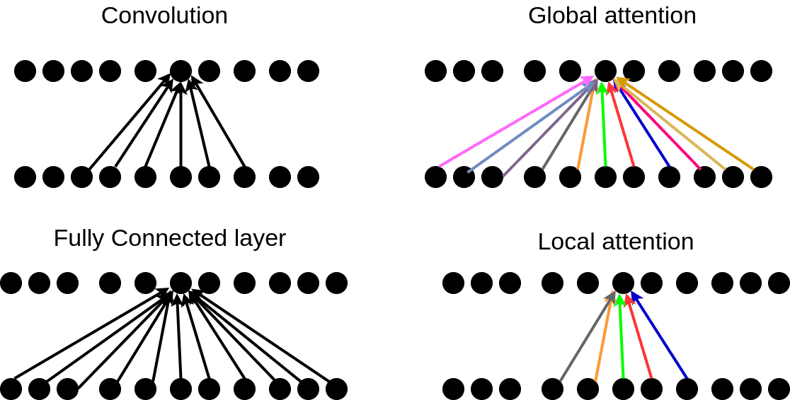

## Add Layer?

As we progressively add layers, the receptive field of the network slowly increases. If we are using 3x3 kernels, then each pixel in the second layer has only "seen" (receptive field) 3x3 pixels. Before the network can take any decision, the whole image needs to be processed

There are different kinds of attention spans or receptive fields.
-   Convolution is, rather, a local operator (till the last layer). 
-   FC layer on the other hand has a full Receptive Field or Attention span. 💯% 
-   Full Attention is expensive, and 
-   local attention is limiting



## [RF Calculation ](https://distill.pub/2019/computing-receptive-fields/)

$$n_{out}= {n_{in}+2p-k \over{s}}+1$$

$n_{out}: number of output features$

$n_{in}: number of input features$

$k: convolution kernel size$

$p: convolution padding size$

$s: convolution stride size$

$$j_{out}=j_{in}+(k-1)*j_{in}$$
$$j_{out}=j_{in}*s$$
$j_{in}$(jump or representation power of the pixels)(also notice it's called j-in and not j-out) is basically how many strides in total we have taken till now. 

$j_{out}$ is going to be $j_{in}$ for next layer,
If I do jump, rf increase in next layer


## Convolution Mathematics

- blurr image
- vertical edge detectors

## Strides
So, when we add strides, our output channel size reduces drastically.
- strides larger than 1 are fast, but comprommise on 
    - the quality of data read
    - checkerboard issue
- Shift Invariance
- Rotational Invariance
- Scale Invariance

e.g)
$120*120 --> 3*3 kernel (s=3,k=3,p=0) --> 40*40$ 9 times, smaller


## Max pooling
- to reach RF faster with less layer.

## 3x3 is misleading (SIMD Operations)
- all we need is 4 layers with proper feature extractor.
- computationally impossible.

```c
a = [
    ['-1', '2', '-1'], 
    ['-1', '2', '-1'],
    [ '-1', '2', '-1']
] #vertical detector

k = [
    [.2,.2,.9],
    [.1,.1,.9],
    [.0,.2,.8]
]
result = a@k
```

3*3 matrix multiplication in GPU
```c
-1	2	-1	-1	2	-1	-1	2	-1	
0.2	0.2	0.9	0.1	0.1	0.9	0.0	0.2	0.8	-2.0
0.2	0.9	0.2	0.1	0.9	0.3	0.2	0.8	0.1	4.3
0.9	0.2	0.5	0.9	0.3	0.2	0.8	0.1	0.1	-2.3
0.1	0.1	0.9	0.0	0.2	0.8	0.2	0.3	0.9	-1.7
0.1	0.9	0.3	0.2	0.8	0.1	0.3	0.9	0.1	4.1
0.9	0.3	0.2	0.8	0.1	0.1	0.9	0.1	0.2	2.1
0.0	0.2	0.8	0.2	0.3	0.9	0.1	0.1	0.9	-1.7
0.2	0.8	0.1	0.3	0.9	0.1	0.1	0.9	0.3	4.1
0.8	0.1	0.1	0.9	0.1	0.2	0.9	0.3	0.2	-2.1
```
## Multi-Channel Convolution
$24*120*120$ convolves with $100*24*3*3(p=0;k=3;no.K=100;s=1)$ gives $100*1*118*118$


|**NAME**| $Channel_{in}$ | $Channel_{out}$ | $r_{in}$ | $r_{out}$ | $J_{in}$ | $J_{out}$ | Pad | Stride | Kernel | Param # (bias=F)               | Param # (bias=T) |
|--------|----------------|-----------------|----------|-----------|----------|-----------|-----|--------|--------|--------------------------------|------------------|
|CONV1   | 28             |28               | 1        |3          | 1        |1          |1    |1       |3       |(3 * 3) * 32 = 288              |  320             |
|CONV2   | 28             |28               | 3        |5          | 1        |1          |1    |1       |3       |(3 * 3 * 32) * 64 = 18432       |  18496           |
|MAXPOOL | 28             |14               | 5        |6          | 1        |2          |0    |2       |2       | Nil                            |  Nil             |
|CONV3   | 14             |14               | 6        |10         | 2        |2          |1    |1       |3       |(3 * 3 * 64) * 128 = 73728      |  73,856          |
|CONV4   | 14             |14               | 10       |14         | 2        |2          |1    |1       |3       |(3 * 3 * 128) * 256 = 294912    |  295,168         |
|MAXPOOL | 14             |7                | 14       |16         | 2        |4          |0    |2       |2       |Nil                             |  Nil             |
|CONV5   | 7              |5                | 16       |24         | 4        |4          |0    |1       |3       |(3 * 3 * 256) * 512 = 1,179,648 |  1,180,160       |
|CONV6   | 5              |3                | 24       |32         | 4        |4          |0    |1       |3       |(3 * 3 * 512) * 1024 = 4,718,592|  4,719,616       |
|CONV7   | 3              |1                | 32       |40         | 4        |4          |0    |1       |3       |(3 * 3 * 1024) * 10 = 92,160    |  92,170          |