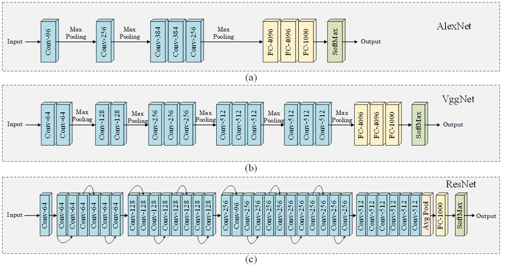
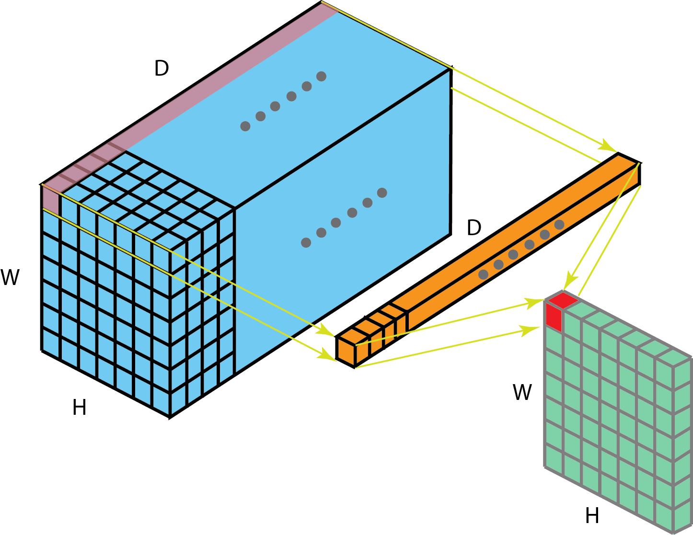
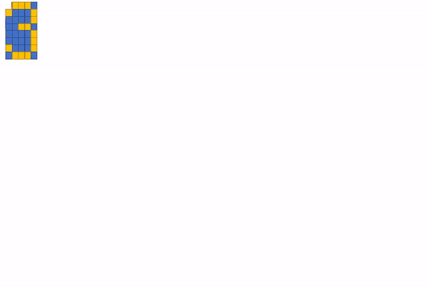

CNN Architectures
---

Fourier
---
- [fourier blog](https://www.jezzamon.com/fourier/) or ([github](https://github.com/Jezzamonn/fourier))
- ([3b1b](https://www.youtube.com/watch?v=spUNpyF58BY))

NN can have a large number of free parameters (or weights between interconnected units) and this gives them the flexibility to fit highly complex data (when trained correctly) that other models are too simple to fit

Activation Function
----
- [Comprehensive Survey](https://arxiv.org/pdf/2109.14545.pdf)
- use ReLU 😉

CNN Features
---
- [cnn Visualization](https://poloclub.github.io/cnn-explainer/)
- [feature visualization](https://distill.pub/2017/feature-visualization/)
- [Invarient Features](https://www.quora.com/How-is-a-convolutional-neural-network-able-to-learn-invariant-features)

# **Note:**
- MaxPool saves from height and width of featuremaps.
- 1*1 saves from channels increament. Acts like Mixer
  Wouldn't it be better to merge our 512 kernels into 32 richer kernels that could extract multiple features which come together?

**1x1 provides all these features.**
- 1x1 is computation less expensive.
- 1x1 is not even a proper convolution, as we can, instead of convolving each pixel separately, multiply the whole channel with just 1 number
- 1x1 is merging the pre-existing feature extractors, creating new ones, keeping in mind that those features are found together (like edges/gradients which make up an eye)
- 1x1 is performing a weighted sum of the channels, so it can so happen that it decides not to pick a particular feature that defines the background and not a part of the object. This is helpful as this acts like filtering. Imagine the last few layers seeing only the dog, instead of the dog sitting on the sofa, the background walls, painting on the wall, shoes on the floor, and so on. If the network can filter out unnecessary pixels, later layers can focus on describing our classes more, instead of defining the whole image. 

**checkboard**
[issue_not_yet_solved](https://distill.pub/2016/deconv-checkerboard/) hint: Deconvolution (or) Atrous Convolution

**Embedding**
- NLP data represent in 1D What if NLP acts like Image, then Embeddings could be, 

**Positional Embedding**
- Lossing info form 2d to 1d

  

  then add position to it, hmmm, make like weight. so add signals from fourier concept.

  
  

  