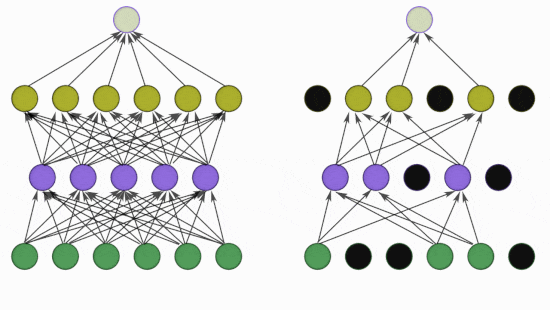

# BATCH NORMALIZATION & REGULARIZATION

## Image Normalizing 📷

- Normalization is a process that changes the range of pixel intensity values

### Normalization Techniques
- scaling to a range
- clipping
- log scaling
- z-score

Why need to redistribution need? We might need want specific details not all information is essential

`Note`: Equalization makes image histogram as equal. Equalization is not Normalization

## Loss & Weight with/without Normalization 🏋️

## [Batch Norm](https://arxiv.org/abs/1502.03167)
Batch Normalization solves a problem called the **Internal Covariate Shift**
- **Covariate** means Feature
- **Covariate shift** means that the distribution of features is different in different parts of the training/test data.

`Key:` Very Deep nets can be trained faster and generalize better when the distibution of activation is kept normalized during Backprop

$\gamma,\beta$ are trainable parameters, and $\mu,\sigma$ are non-trainable parameters


BN Decay or Momentum

$\mu_{mov} = \alpha*\mu_{mov} + (1-\alpha)*\mu_{B}$

$\sigma_{mov}^{2} = \alpha*\sigma_{mov}^{2} + (1-\alpha)*\sigma_{B}^{2}$

## [Layer Norm](https://arxiv.org/abs/1607.06450)

Normalize across Layers of the Channel

**2D Visuals**


Info
----
Batch has 2 Images and 256 Embedding size,

In BN: $\mu_{1,2,....256}$ and $\sigma_{1,2,....256}$

IN LN: $\mu_{1,2}$ and $\sigma_{1,2}$

**3D Visuals**

Info
----
Layer Normalization calculates params across every batches in our case every texts/images.

Batch Normalization calculates params every channels across all batches in our case all text/images.


Retrospective Thinking 💭
=====================
- Every text have their own embedding.
- Feature across similar Images have shared their channels
- Increase Batch Size, Increase Epoch bcz updates are smaller

e.g)
Total Images = 4_00_00_000 and Epoch=400 and lr=fixed 

| BatchSize  | 128 | 256 | 2048 | 
|------------|------|-----|-----|
| Steps/Epoch| 31250| 15625 | 1953 |
|Total Steps | 12500000| 6250000 | 781250|
|Max More Steps |      | 2      | 16|

## [Group Norm](https://arxiv.org/abs/1803.08494)
Group Normalization with group=1 makes it BATCH Normalization

## [Instance Norm](https://arxiv.org/pdf/1607.08022v3.pdf)

```
Q: ReLU before BN or BN before ReLU? 🎰
A: https://www.youtube.com/watch?v=GUtlrDbHhJM&t=3182s
```

## Regularization
- [X] dropout  
- [X] Early Stopping 🚫
- [ ] Dataset Augmentation
- [X] L1 & L2 Regularisation  (L2 includes force of model to have less parameter)

`Note` Batch Size no effect on regularization



**L2**
```python
optimizer_sgd = torch.optim.SGD(params,lr=1e-2,momentum=0.9,weight_decay=0)
```
**L1**
```py
loss = mse(pred,target)
l1   = 0
for p in net.parameters():
    l1  = l1+ p.numel()
loss = loss + (lambda_l1 * l1)
loss.backward()
optimizer.step()
```

```sh
NLP   > Layer Normalization
Vision> BN
```
